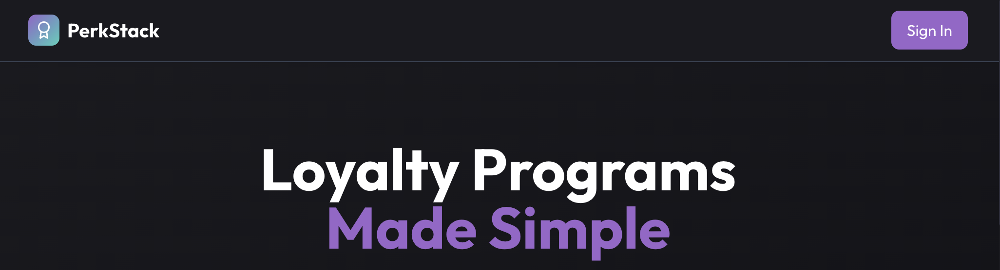

# 🧱 PerkStack – The Developer-First Customer Loyalty Platform

 <!-- Replace with your actual banner image -->

**PerkStack** helps you build, test, and deploy powerful loyalty systems with full control over data, logic, and infrastructure. Whether you're shipping for SaaS, e-commerce, or mobile apps—PerkStack gives you everything you need to go from prototype to production in weeks.

---

## 🎥 Demo Video

[](https://youtu.be/your_video_id)  
➡️ _Click to watch the 90-second walkthrough!_

---

## 🚀 Features

- 🔧 **Developer-Centric** – Built with Node.js, TypeScript, Vite, React, Prisma, Tailwind.
- 🔐 **Flexible Auth** – Easily integrate JWT, Firebase, or Auth0.
- 🎯 **Custom Logic** – Enforce tiers, point expiration, and redemptions via your own rules.
- 🧰 **Full Stack Toolkit** – Includes database modeling, API layer, and React-based frontend.
- 🧪 **Test Ready** – Supports Jest, Supertest, and Cypress for rock-solid quality.
- ☁️ **Cloud Native** – Deploy on Vercel, Heroku, AWS, or your own infra.
- 💳 **Stripe-Ready** – SaaS and self-hosted licensing supported out of the box.

---

## 📦 Getting Started

```bash
git clone https://github.com/your-org/perkstack.git
cd perkstack
cp .env.example .env.local
npm install
npm run dev
````

🔗 *Includes everything: PostgreSQL (or MongoDB) schema, backend API, frontend app, CI/CD pipeline.*

---

## 🗺️ Architecture Overview

 <!-- Replace with architecture diagram -->

1. **Frontend** – Vite + React + Tailwind
2. **Backend** – Node.js + Express/Fastify + Prisma
3. **Database** – PostgreSQL or MongoDB
4. **Auth** – JWT or Firebase/Auth0
5. **CI/CD** – GitHub Actions → Lint → Test → Deploy
6. **Hosting** – Vercel / Heroku / AWS / DigitalOcean

---

## 🧪 Testing

```bash
# Run unit tests
npm run test

# Run integration tests
npm run test:integration

# Run E2E tests (Cypress)
npm run test:e2e
```

---

## 🌍 Deployment

* **Frontend:** Vercel, Netlify, or static hosting
* **Backend & DB:** Heroku, AWS ECS/RDS, DigitalOcean App Platform
* **Docker:** Full Docker + Docker Compose support
* **Env Config:** Uses `.env.local` and secret managers per environment

---

## 🛠️ Build Your Own Loyalty Logic

```ts
// Example: Prevent redemption if not enough points
if (user.points < reward.cost) {
  throw new Error('Insufficient points');
}
```

*Add your own business rules: point expiration, tier upgrades, bonus multipliers, and more.*

---

## 📚 Documentation

* [Quick Start Guide](docs/quick-start.md)
* [API Reference](docs/api-reference.md)
* [Entity Diagram](docs/data-model.md)
* [Deployment Guide](docs/deployment.md)

---

## 💼 License & Billing

* Supports both **SaaS subscriptions** and **self-hosted licenses**
* Stripe integration for billing & trials
* Token or key-based access control for self-hosted clients

---

## 📣 Stay Updated

* Website: [https://perkstack.dev](https://perkstack.dev)
* Twitter: [@perkstack](https://twitter.com/perkstack)
* YouTube Demo: [Watch here](https://youtu.be/your_video_id)

---

## 🧩 Contributing

Want to contribute or build plugins? Check out our [CONTRIBUTING.md](CONTRIBUTING.md) guide.

---

## 📥 Support

* Submit issues via GitHub
* Email: [support@perkstack.dev](mailto:support@perkstack.dev)

---

© 2025 PerkStack. All rights reserved.
